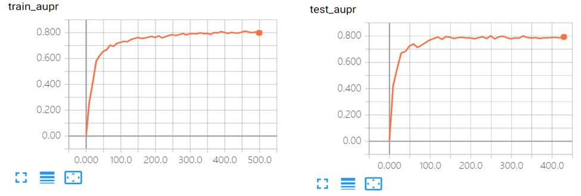
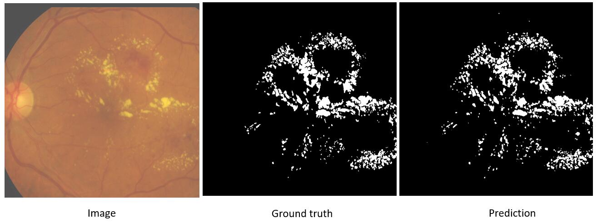

# Lesion Segmentation
The automatic segmentation of retinal lesions.

# Dependence
* python 2.7 
* tensorflow 1.6
* tensorlayer 1.8

# Data
* It consists of 81 images with pixel level annotation, training data 54 samples, test data 27 samples.
* [Down Load Indian Diabetic Retinopathy Image Dataset (IDRiD)](https://ieee-dataport.org/open-access/indian-diabetic-retinopathy-image-dataset-idrid)

# Performance Evaluation
Evaluates the performance of the algorithms for lesion segmentation using the available binary masks. The area under precision-recall (AUPR) is used to obtain a single score.

# Experiment

# Result

